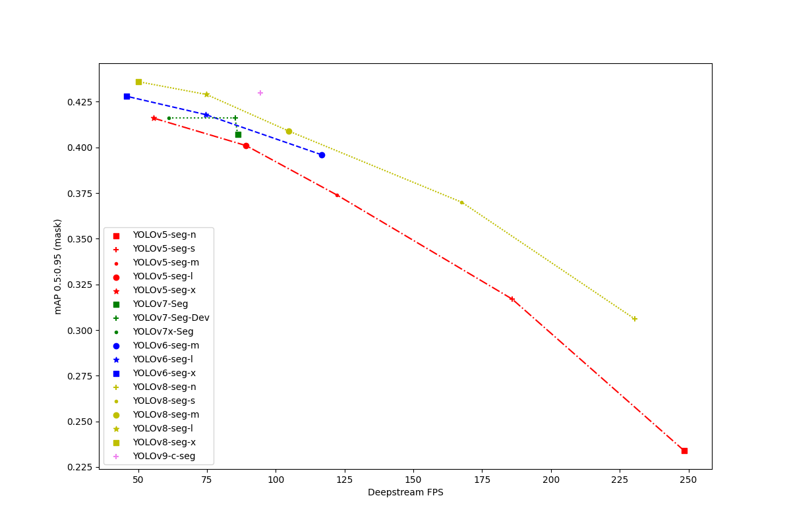

# Benchmark realtime instance segmentation model

    

| model          | Deepstream FPS | Latency | End-to-End Host Latency | mAPval 0.5:0.95 (Box) | mAPval 0.5 (Box) | mAPval 0.5:0.95 (Mask) | mAPval 0.5 (Mask) |
| -------------- | -------------- | ------- | ----------------------- | ----------------------------- | ------------------------ | ------------------------------ | ------------------------- |
| YOLOv5-seg-n   | 248.37         | 4.77641 | 8.35323                 | 0.27                          | 0.437                    | 0.234                          | 0.407                     |
| YOLOv5-seg-s   | 185.89         | 5.8429  | 10.5039                 | 0.371                         | 0.56                     | 0.317                          | 0.528                     |
| YOLOv5-seg-m   | 122.18         | 8.85596 | 16.3577                 | 0.446                         | 0.627                    | 0.374                          | 0.596                     |
| YOLOv5-seg-l   | 89.22          | 11.613  | 26.3916                 | 0.485                         | 0.661                    | 0.401                          | 0.63                      |
| YOLOv5-seg-x   | 55.71          | 21.3792 | 41.4462                 | 0.503                         | 0.68                     | 0.416                          | 0.651                     |
| YOLOv7-Seg     | 86.16          | 12.423  | 23.3168                 | 0.491                         | 0.67                     | 0.407                          | 0.639                     |
| YOLOv7-Seg-Dev | 85.23          | 12.1612 | 22.9236                 | 0.506                         | 0.681                    | 0.416                          | 0.65                      |
| YOLOv7x-Seg    | 61.04          | 17.5312 | 33.8681                 | 0.503                         | 0.68                     | 0.416                          | 0.651                     |
| YOLOv6-seg-m   | 116.65         | 9.0022  | 16.521                  | 0.481                         | 0.65                     | 0.396                          | 0.62                      |
| YOLOv6-seg-l   | 74.47          | 13.6746 | 25.9031                 | 0.509                         | 0.677                    | 0.418                          | 0.65                      |
| YOLOv6-seg-x   | 45.85          | 29.5015 | 57.7406                 | 0.52                          | 0.69                     | 0.428                          | 0.663                     |
| YOLOv8-seg-n   | 230.55         | 4.99231 | 8.78412                 | 0.363                         | 0.52                     | 0.306                          | 0.495                     |
| YOLOv8-seg-s   | 167.59         | 6.28845 | 11.3093                 | 0.444                         | 0.609                    | 0.37                           | 0.582                     |
| YOLOv8-seg-m   | 104.67         | 10.1465 | 19.0956                 | 0.495                         | 0.661                    | 0.409                          | 0.634                     |
| YOLOv8-seg-l   | 74.81          | 13.7002 | 26.094                  | 0.52                          | 0.687                    | 0.429                          | 0.659                     |
| YOLOv8-seg-x   | 50.07          | 20.3616 | 39.6831                 | 0.531                         | 0.697                    | 0.436                          | 0.669                     |
| YOLOv9-c-seg   | 94.38          | 11.6047 |                         | 0.529                         | 0.698                    | 0.43                           | 0.668                     |
